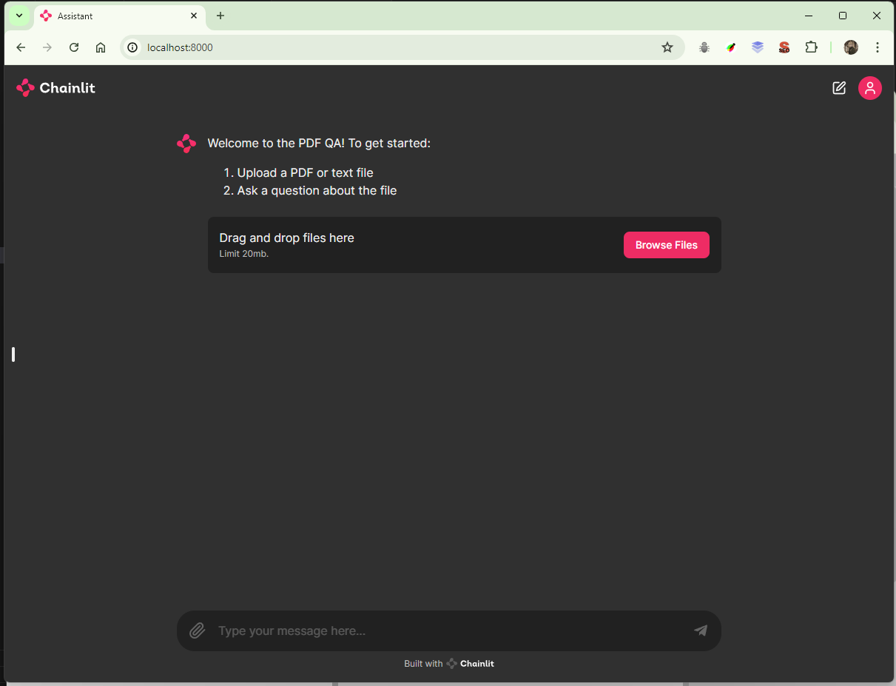

# Helmet Safety Detection
This application utilizes the Retrieval-Augmented Generator (RAG) model to answer your document-related questions. RAG is a machine learning model that combines information retrieval and language generation techniques to achieve high performance in document question answering tasks.


## Getting Started

This section details how to set up the development environment to run the application.

### Clone the Repository

- Open your terminal.
- Run the following command to clone the repository

Bash

```
git clone https://github.com/ThuyTran07/QnA_with_PDFs.git

```

**Note:** Use the provided command with caution. It will download the entire repository to your local machine.

### Create a Virtual Environment

It's recommended to create a virtual environment to isolate project dependencies. Here's how to do it depending on your operating system:

**Linux/macOS:**

Bash

```
python3 -m venv venv
source venv/bin/activate

```

**Windows:**

Bash

```
python -m venv venv
venv\Scripts\activate

```

**Note:** Use the provided commands with caution. They will create and activate a virtual environment named `venv`.

### Install the Required Dependencies

Once the virtual environment is activated, install the required dependencies listed in the `requirements.txt` file using the following command:

Bash

```
pip install -r requirements.txt

```

**Note:** Use the provided command with caution. It will install all the necessary libraries from the `requirements.txt` file.

## Running the App


Now that the environment is set up, you can start the Streamlit development server. Navigate to the project directory in your terminal and run:

Bash

```
streamlit run qna_w_pdf.py

```

This will launch the Chainlit application in your web browser.


